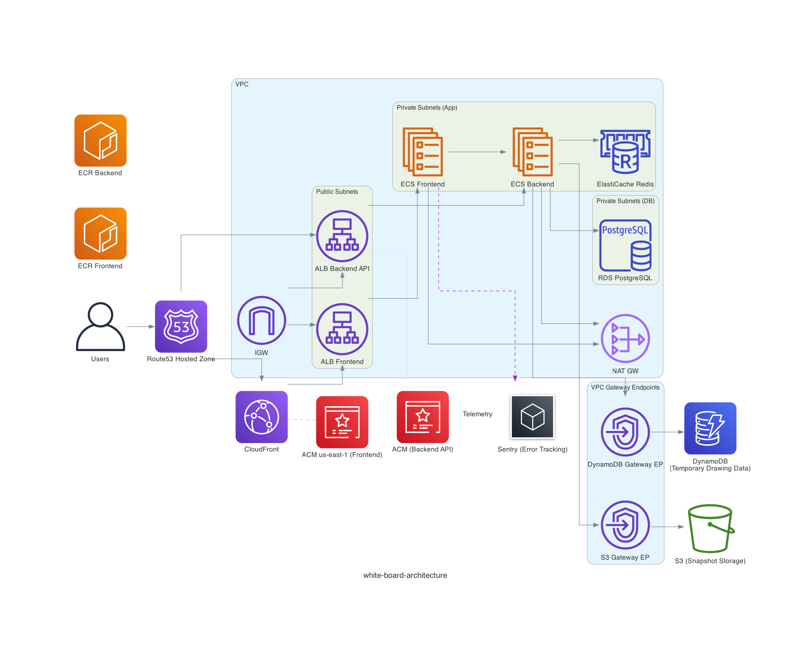
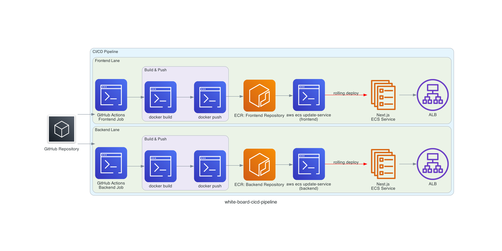

# white-board-infra

White Board アプリケーションの AWS インフラストラクチャ（Terraform）

## アーキテクチャ図



## CI/CD パイプライン

- **概要**: フロントエンド/バックエンドの各ジョブで `docker build` → `docker push` を行い ECR を更新し、その後 `aws ecs update-service --force-new-deployment` で各 ECS サービスを最新イメージにローリングデプロイ。



## Terraform でのインフラ構築手順

前提:
- AWS CLI が設定済み（適切な権限のクレデンシャル）
- Terraform v1.0+ がインストール済み
- `terraform.tfvars` に必要な変数が設定済み

1. 初期化
   ```bash
   terraform init
   ```

2. 構成の検証とプラン作成（任意）
   ```bash
   terraform validate
   terraform plan
   ```

3. 構築（apply）
   ```bash
   terraform apply
   ```

4. 出力値の確認
   ```bash
   terraform output
   ```

5. 破棄（必要な場合のみ）
   ```bash
   terraform destroy
   ```

補足:
- CloudFront/ACM などは反映まで時間がかかる場合ある。
- CloudFront 用 ACM 証明書は `us-east-1` で作成されます（`provider "aws" { alias = "us_east_1" }`）。
- DNS/NS 切替（Route 53 → レジストラ）: Hosted Zone 作成後に出力される Name servers(4件) をレジストラ側 NS に置き換え、旧 NS/DS は削除する。
- ACM の DNS 検証(CloudFront用): 検証用 CNAME が解決していることを確認。証明書発行～CloudFront 反映には 15–30 分程度かかる。
